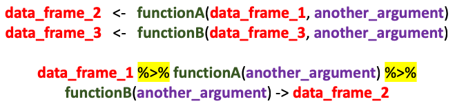

```{r setup, include=FALSE}
knitr::opts_chunk$set(echo = TRUE, warning = FALSE, message = FALSE)
library(tidyverse)
```

# Overall aims


1.  Introduce rookies to power and potential of R
2.  Provide R veterans with a means to practise their existing skills
3.  Introduce a few tricks / techniques which will (hopefully) be novel for veterans: creating your own functions / contrast coding

# Accessing these files

The RMarkdown file used to create this website can be accessed [here](Winter school.Rmd)

The dataset is very large. If you find yourself running into performance issues, a dataset containing responses of only Spanish and German monolinguals can be accessed [here](Spanish_German.csv)

# Dataset 1

We are going to be exploring a dataset published by Hartshorne, Tenenbaum and Pinker:

Hartshorne, J. K., Tenenbaum, J. B., & Pinker, S. (2018). A critical period for second language acquisition: Evidence from 2/3 million English speakers. Cognition. <https://doi.org/10.1016/j.cognition.2018.04.007>

This explores the English grammatical abilites of 2/3 million individuals who have acquired English as a second language. As such, it presents an *unparallelled* opportunity to test theories of L1 transfer during second language learning.

The data has been published on the Open Science Framework at <https://osf.io/pyb8s/>

# Basics

## Setting the working directory

Initially you need to the set the Working Directory to the location of the source file, as follows

 Or just create an RProject:


You open the RProject, and the working director is already set

## Packages

2 stage process: (1) Install, (2) Load

In RStudio, all packages listed in initial `setup` chunk are automatically loaded.

A really good way of managing packages is `pacman`. Just use `pacman::p_load(package1, package2)` anywhere. It will (a) install pacakge if not installed, or if installed version is old, (b) load the package

```{r}

library(tidyverse)

pacman::p_load(tidyverse)

```

`package::function()` - enables you to call a function without loading the package first (it is also very useful when two different packages have functions of the same name).

## Reading in the data

Now we're going to read in the data... but it will take some time.

## Viewing the data


```{r}

df <- read_csv("https://osf.io/g72pq/download")

```

Take a peek at the data either using `View(df)` (to view it in a special viewer), or `head(df)` (to view it in the console / RMarkdown file)

# Exercise 1

(a) Explore the language backgrounds of the participants using whatever graphical technique you prefer
(b) Convert the dataset into a form which you can process. This will involve changing the shape of the data from wide to long. (NB In order to analyse the responses you need to merge the question number with the data containing the text of the questions. This is provided in a separate file called `questionnaire.csv`)

# Exercise 1 - answer

## Wide versus long formats

We can see that each row corresponds to a single participant, and that there are multiple observations per row (different variable for different questions). This is a *wide* format, and is the wrong format for doing summaries and analyis. (NB I think Hartshorne et al. use this format because it gobbles up less memory).

A much better format is a 'long' or 'tidy' format:


We're going to find out how to do this in a moment.

## Exploring the data

Now let's look at the languages which people speak. To do this we're going to use the 'piping' notation. This comes as part of the tidyverse package. Piping works as follows



Piping has the following characteristics

1.  There is no need to keep referring to the data frame.
2.  Statements may be 'daisy-chained'.
3.  You can 'try before you buy'. This means we can check the output of a pipe before passing that to another pipe / data frame. We therefore minimise the risk of accidentally destroying a dataset
4. Pipes may be inserted inside other commands (statistical models & plots). This means we can plot / analyse data without having to constantly create new datasets.

Below I have created a data frame summarising the L1 characteristics of the participants. I'm sure you will agree that the piped example is more intelligible.

```{r}

df2 <- count(df, primelangs)
df3 <- arrange(df2, desc(n))
df3$id <- seq.int(1, nrow(df3), by = 1)

df %>%
  count(primelangs) %>%
  arrange(desc(n)) %>% 
  mutate(id = row_number()) -> df.L

```

## Dplyr verbs

The commands I have used in the pipe all belong to the `dplyr` package which is part of the `tidyverse`. Here is a list


## Visualising the data

We're now going to draw some bar charts to summarise the language data using the `ggplot` package:

```{r}

# One way

g <- ggplot(df.L,aes(id,n)) +
     geom_bar(stat = "identity")

g

# But I find this more intuitive, as you can build up the chart in layers...

g <- ggplot(df.L, aes(id, n))
g <- g + geom_bar(stat = "identity")
g <- g + xlim(0, 34)
g <- g + ylim(0, 350000)
g <- g + geom_text(aes(id, n, label = primelangs), angle = 45, nudge_x = 0.5, hjust =0, vjust = 0, size = 3)

g

```

```{r}


g <- ggplot(df.L %>% filter(primelangs != "English"))
g <- g + (aes(id, n))
g <- g + geom_bar(stat = "identity")
g <- g + xlim(0, 30)
g <- g + ylim(0, 35000)
g <- g + geom_text(aes(id, n, label = primelangs), angle = 45, nudge_x = 0.5, hjust =0, vjust = 0, size = 3)
g

```

## Now for some real wrangling!

### Filtering

Okay. Now we're going to transform the data from the wide format into a long format. I was originally hoping to transpose the entire data set. However, this pretty much crashes the machine as it creates a dataset of over 15 million observations! Therefore we are just going to select participants who speak Spanish, French and German as their first languages.

```{r}

df %>%
  filter(primelangs == "Spanish" |
         primelangs == "French" |
         primelangs == "German") -> df.sfg

df %>%
  filter(primelangs %in% c("Spanish", "French", "German")) -> df.sfg

```

### Using your own function

But what if I wish to include individuals with more than one language (one of which is Spanish / French / German)

We will do this by creating our own function


(NB "Return" is not strictly necessary. If you don't use "return", this will output the value of the last statement. However, I like to use it because it helps me keep track of what the function is doing)

Here is a simple function:

```{r}

plus_one <- function(x){
  return(x + 1)
}

plus_one(20)

```

How do we count the languages?

```{r}
num_langs <- function(x){
  return(1 + str_count(x, ","))
}
```

Now let's create a variable to show the number of languages:

```{r}
df$num_langs = num_langs(df$primelangs)

df$num_langs = sapply(df$primelangs, num_langs)
```

Now how do we identify strings containing either "Spanish", "French" or "German"?

```{r}

contains_sfg <- function(x){
  result <- str_detect(x, "Spanish") + str_detect(x, "German") + str_detect(x, "French")
  return(result)
}

df$sfg <- contains_sfg(df$primelangs)

```

```{r}

df %>%
  filter(sfg > 0) -> df.sfg

```

## Pivoting (converting from wide to long)

Now we're going to change the data from wide to long. `dplyr` (a package which is part of the tidyvers) contains a variety of commands to manipulate entire data frames. The commands `pivotwider` and `spread` are used to go from wide-to-long and from long-to-wide respectively. This is how gather works...


And this is our command...

```{r}

df.sfg.l <- pivot_longer(data = df.sfg,
                        starts_with("q"),
                        names_to = "question",
                        values_to = "answer")

df.sfg.l %>% 
  arrange(id, question) ->
  df.sfg.l

```

The expression `starts_with("q")` specify that the columns to be pivoted are all those columns whose names start with "q". I have arranged the data by 'id' as otherwise they will be arranged by question.

## Merging

Now take a peek at the data using `head(df)` or `View(df)` to determine whether the procedure has worked. We can see that the questions have all been 'rotated'. However, it's difficult to see what each question refers to. So that we can see this, I have created a file called `questionnaire.csv` which contains a unique identifier for each question, followed by some information about the question, e.g. what linguistic construct it tests. I have assembled this from reading the appendix to the article.

Now, having saved the `questionnaire.csv` file to the appropriate locaction, I am going to merge the two data sets:

```{r}

df.qs <- read_csv("questionnaire.csv")

df.sfg.l %>%
  merge(df.qs, by.x = "question", by.y = "q") -> df.sfg.l

```

Note that the linking variable has a slightly different name in each data set (the x and y datasets). If the linking variable had the same name we would just have the option `by = "var_name"`.

# A simple analysis

Now let's do some actual analysis.

I'm particularly interested in question 21 which tests masculine Indirect Object Pronouns. I'm interested in seeing whether Spanish speakers are particularly poor at selecting the right answer because in Spanish, the Subject and Indirect Object masculine pronouns have the same form, e.g.

1.  *El* dió el libro a *el*
2.  *Il* a donné le livre a *lui*

German also makes a morphological distinction between the Subject and Indirect Object forms.

# Exercise 2

(1) Explore the relationship between the number of languages one speaks and one's overall performance on the test.
(2) For question 21, investigate the impact of one's primary language on performance
(3) For the above analysis investigate whether the impact of one's primary language on performance is confounded by the amount of time that one has spent learning English.


```{r}


mod.num_langs <- glm(propn_correct ~ num_langs,
                     data = df.sfg.l %>%
                            group_by(id, num_langs) %>%
                            summarise(propn_correct = mean(answer.x)))

df.sfg.l %>% 
  mutate(spanish_contrast = ifelse(primelangs == "Spanish", 0.5, -0.25)) -> df.sfg.l

mod.io <- glm(answer.x ~ spanish_contrast,family=binomial(link='logit'),
             data = df.sfg.l %>% filter(question == "q21_1" & num_langs == 1))

summary(mod.io)

exp(coef(mod.io))

exp(mod.io$coefficients)

```

We can see that the Spanish speakers are significantly worse at this question, consistent with our hypothesis. However, it might just be the case that the Spanish respondents have less good English overall. Therefore we need to re-run the regression while controlling for basic L2 English abilities. The dataset provides an `eng_start` variable which correponds to the age when participants started English. Let's re-run the regression model controlling for both `end_start` and length of learning (which we'll have to calculate)

```{r}

df.sfg.l$length_of_learning <- df.sfg.l$age - df.sfg.l$Eng_start

mod.sp.ll <-glm(answer.x ~ spanish_contrast + length_of_learning, family=binomial(link='logit'), data = df.sfg.l %>% filter(question == "q21_1" & num_langs == 1))

summary(mod.sp.ll)

exp(coef(mod.sp.ll))

```

Yes, the Spanish speakers still perform significantly worse.

Let's plot performance by language, and years spent studying English

```{r}

g <- ggplot(aes(x = length_of_learning, y = correct, color = primelangs),
            data = df.sfg.l %>%
                            filter(question == "q21_1" & num_langs == 1) %>% 
                            group_by(primelangs, length_of_learning) %>%
                            summarise(correct = mean(answer.x))
            )

g <- g + geom_smooth()

g

```

Spanish speakers catch up after 70 years of learning! There is much more variation for the Spanish learners than the other learners.

Let's compare this with passives. Spanish has a form of the passive which is very closely related to the English passive.

```{r}

g <- ggplot(aes(x = length_of_learning, y = correct, color = primelangs),
            data = df.sfg.l %>%
                            filter(question == "q1" & num_langs == 1) %>% 
                            group_by(primelangs, length_of_learning) %>%
                            summarise(correct = mean(answer.x))
            )

g <- g + geom_smooth()

g

```

We can see that Spanish speakers are much better from the start. But what is happening to the Swiss German speakers!!???

# Over to you!

What hypotheses would you like to explore?
